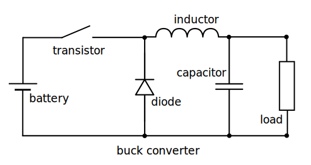
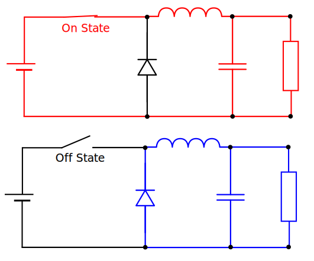

+++
date = '2026-01-26T19:23:34+01:00'
draft = true
title = 'Solar Charge Controller Firmware'
math = true
categories = ["Solar", "DIY"]
+++

This document provides a comprehensive guide to the firmware for the FUGU-MPPT, a 1-kilowatt Maximum Power Point Tracking (MPPT) solar charge controller. It is intended for electronics enthusiasts, students, and DIYers who want to understand, build, and customize their own high-efficiency solar charge controller. This project is based on the original MPPT solar charge controller project by [AngeloCasi](https://github.com/AngeloCasi/FUGU-ARDUINO-MPPT-FIRMWARE).

# Original Project

This project is based on the outstanding open-source work by AngeloCasi.
* **Original Firmware:** [AngeloCasi/FUGU-ARDUINO-MPPT-FIRMWARE](https://github.com/AngeloCasi/FUGU-ARDUINO-MPPT-FIRMWARE)
* **Instructables Guide:** [1kW Arduino MPPT Solar Charge Controller](https://www.instructables.com/DIY-1kW-MPPT-Solar-Charge-Controller/)

# Overview

An MPPT solar charge controller is a smart DC-to-DC converter that optimizes the power harvested from a solar panel. It adjusts its operating point (voltage and current) to match the panel's maximum power output, which varies with sunlight and temperature, and thereby improves the amount of power harvested from the solar panel.

## Key Specifications

* **Topology:** Synchronous Buck (Step-Down) Converter.
* **Control Variable:** PWM Duty Cycle ($D$).
* **Algorithm:** Perturb and Observe (P&O).

## Firmware Files

The firmware is organized in multiple files, each with a specific function: 

|                                                                                           |
|:---                               |:---                                                   |
| **mppt_charge_controller.ino**    | Initialization, and loops the code.                   |
| **1_Read_Sensors.ino**            | Reads measurements from sensors.                      |
| **2_System_State.ino**            | Determines the state of the system.                   |
| **3_Calibrate_Sensors.ino**       | Sets the midpoint of the current sensor.              |
| **4_Buck_Algorithms.ino**         | Algorithms for controlling the buck converter.        |
| **5_System_Processes.ino**        | Fan control and some telemetry calculations.          |
| **6_Onboard_Telemetry.ino**       | Prints telemetry to the serial console.               |
| **7_Wireless_Telemetry.ino**      | Manages WiFi and Bluetooth communication.             |

## Variables

The important variables are stored in the following structures:

* **SensorData**: voltages, currents, power, temperature
* **SensorCalibration**: calibration value for the current sensor
* **SystemState**: a number of flags that keep track of the system state
* **ControlState**: control flags
* **PwmState**: values related to the PWM duty cycle
* **TelemetryData**: other telemetry data, like energy harvest

## Hardware

This firmware is not standalone; it is designed to run on a specific hardware designed by AngeloCasi, of which the details can be found in the [Instructibles](https://www.instructables.com/DIY-1kW-MPPT-Solar-Charge-Controller/) guide. **You must build the circuit for this code to be useful.**

# Software

The project should still be compatible with the Arduino IDE development suite, but I mainly use PlatformIO for programming the board and checking serial output. All the following commands are for a Linux system.

## USB Drivers

Most ESP32 development boards use a USB-to-UART bridge chip like the **CP2102** or **CH340**. Modern Linux and Windows operating systems often come with these drivers pre-installed, but they can be added manually if the chip is not detected. The `lsusb` command will show if the chip/board was detected by the system.

```
lsusb
```

In Linux, communication with (external) devices happens through device files in the `/dev` directory. It's easy to figure out which device file corresponds with the board, just run `dmesg` and plug the USB cable of the board into the computer, it will show the device file (for example `/dev/ttyUSB0`).

```
sudo dmesg --follow
```

## Arduino IDE

The [Arduino IDE][arduino] software is installed using your system's package management system. The current user also needs to be added to the `dialout` group to access devices like `/dev/ttyUSB0`, which is where the board will appear in the filesystem.

```
sudo apt install arduino -y
sudo usermod -a -G dialout $USER
```

### Board Configuration

The Arduino IDE is compatible with many different boards and microcontrollers. The following configures it for the ESP32 development board. Start of by adding the *Board Support Package* for the ESP32 development board by opening the Arduino IDE and going to **File | Preferences.** Add the URL of the board support package under **Additional Boards Manager URLs**:

  ```
  https://raw.githubusercontent.com/espressif/arduino-esp32/gh-pages/package_esp32_index.json
  ```

Then go to **Tools | Board | Boards Manager**, seach for `esp32` and install the package from **Espressif Systems**. Installation might take a while as the package is large. When installation is done, go to **Tools | Board | ESP32 Arduino** and select the **ESP32 Dev Module**. Then go to **Tools | Ports** and select the device where the board can be reached (e.g. `/dev/ttyUSB0`). The Arduino IDE should now be able to communicate with the development board. The other board settings in the **Tools** menu can probably be left at their default values but I list them here for future reference:

  ```
  Board: ESP32 Dev Module
  Upload Speed: 921600
  CPU Frequency: 240MHz (Wifi/BT)
  Flash Frequency: 80MHz
  Flash Mode: QIO
  Flash Size: 4MB
  Partition Scheme: Default 4MB with spiffs (1.2MB APP/1.5MB SPIFFS)
  Core Debug Level: None
  PSRAM: Disabled
  Arduino Runs On: Core 1
  Events Run on: Core 1
  Erase All Flash Before Sketch Upload: Disabled
  JTAG Adapter: Disabled
  Zigbee Mode: Disabled
  ```

### Install Libraries

An overview of the libraries used in this project can be found near the beginning of the main project file, where they are included. Most of the libraries come standard with the Arduino IDE, only the `Adafruit ADS1X15` needs to be added manually. For adding it, go to **Sketch | Include Library | Manage Libraries**, search for `Adafruit ADS1X15`, and install the library.

### Upload Firmware

With the board configured and all the libraries installed, it should now be possible to compile the firmware and upload it to the ESP32 board. Start the `sudo dmesg --follow` command to track kernel messages, then plug in the ESP32 board and check the `dmesg` output to see which device file represents the board. The output could look something like the follwing:

```
[27249.610987] ch341 1-1:1.0: ch341-uart converter detected
[27249.611666] usb 1-1: ch341-uart converter now attached to ttyUSB0
```

Then go to **Tools | Port** in the Arduino IDE, and select the serial device in question (e.g. `/dev/ttyUSB0`). Next, click the **Upload** button at the top left of the IDE (the right-arrow icon).

If uploading to the board works then the Arduino environment was set up correctly. However, don't go using this board is your solar setup yet as the firmware needs to first be configured.

## PlatformIO

My preferred way to program the board is by using PlatformIO. A simple command in the terminal is all it takes to upload firmware to the device and look at the serial output.

### Installation

The software is installed as a python module, and as it probably will get used in multiple project the virtual environment is located in the user's home directory.

```
sudo apt update && sudo apt install -y python3-venv
mkdir -p ~/.platformio/penv
python3 -m venv ~/.platformio/penv
source ~/.platformio/penv/bin/activate
pip install -U platformio
pio --version
```

### Use

The `platformio.ini` file contains the configuration for the project, including the platform file and the specific device being used. Following commands then show connected devices, upload to them and monitor their output.

```
source ~/.platformio/penv/bin/activate
pio run
pio device list
pio run --target upload
pio run --target upload --upload-port /dev/ttyUSB0
pio device monitor --port /dev/ttyUSB0
pio run --target upload --upload-port /dev/ttyUSB0 && pio device monitor --port /dev/ttyUSB0
deactivate
```

# How It Works

## Buck Converter

At its core an MPPT charge controller is a buck converter. Its job is to convert the higher voltage of the solar panels into a lower voltage for charging the battery. A buck converter does this with the help of two key components: a transistor that functions as a fast switch, and an inductor that stores electrical energy in a magnetic field. Following is a schematic representation of a buck converter.



The switch controls the buck converter by applying a fast succession of input voltage pulses over the inductor. In each cycle the switch is closed for some amount of time and open for the rest of the cycle. When the switch closes, the increase in voltage causes the current through the inductor to go up, which expands its magnetic field (storing energy). An expanding magnetic field creates a voltage over the inductor that opposes the original change (Lenz's law). This slows down the rate at which voltage and current increase. Then, when the switch opens and the input voltage is removed, the lower voltage causes a decrease in current. A lower current causes a shrinking magentic field, and that shrinking field generates a voltage over the inductor that again opposes the change (using energy). Voltage and current decrease at a lower rate.



The inductor thus stabilizes both voltage and current. The diode in the buck converter is referred to as a "freewheeling diode". Its task is to give the current passing though the inductor a path to go, because if it has nowhere to go the voltage goes up and will damage something. It also keeps the current flowing through the load when the switch is open. The capacitor in the schematic smooths out the output voltage.

## Duty Cycle

The following variables are used in the steady-state derivation:

| Symbol        | Description           
|:---           |:---
| $V_{in}$      | Input voltage from the solar panel.
| $V_{out}$     | Output voltage delivered to the battery.
| $V_L$         | The instantaneous voltage across the inductor.
| $t_{on}$      | Duration the switch is closed (conducting).
| $t_{off}$     | Duration the switch is open (non-conducting).
| $T$           | Total switching period ($t_{on} + t_{off}$).
| $D$           | Duty cycle, defined as the ratio $t_{on} / T$.

To see how the duty cycle of the switch controls the buck converter, we need to have a look at the *Volt-Second Balance* principle. This law says that the current must ramp up exactly the same amount as it ramps down in each cycle for the inductor to operate in steady state. Otherwise the current would either go up until something breaks or it would go to zero. For the current to stay stable, the average voltage over a full cycle has to be zero.

When the switch is closed respectively open:
$$V_{L, closed}=V_{in}-V_{out}$$
$$V_{L, open}=0-V_{out}=-V_{out}$$

For the current to stay stable:

$$(V_{in} - V_{out}) \cdot t_{on} + (-V_{out}) \cdot t_{off} = 0$$
$$(V_{in} - V_{out}) \cdot t_{on} + (-V_{out}) \cdot (T - t_{on}) = 0$$

Solving for the Duty Cycle $D = \frac{t_{on}}{T}$:

$$V_{in} \cdot t_{on} - V_{out} \cdot t_{on} - V_{out} \cdot T + V_{out} \cdot t_{on} = 0$$
$$V_{in} \cdot t_{on} - V_{out} \cdot T = 0$$
$$V_{in} \cdot t_{on} = V_{out} \cdot T$$
$$D = \frac{V_{out}}{V_{in}}$$

This relation is true for any buck converter. As the battery voltage is very stiff and not easily modified, a change of the duty cycle of the buck converter will instead change the input voltage, which is the voltage of the solar panels. That is how changing the duty cycle of the buck converter allows steering the output voltage of the solar panel to the voltage that generates the maximum power.

## Reverse Current

In a buck converter, the duty cycle applies to the high-side MOSFET. When the high-side is off, the low-side turns on to allow inductor current to continue flowing. A very low duty cycle of for example 5% means the high-side is on for 5% of the time, and the low-side is on for 95% of the time. When the low-side MOSFET is on, it creates a path between the battery poles through inductor and low-side MOSFET. If the energy from the inductor is delivered to the battery faster than the low-side MOSFET turns off, the inductor current can drop to zero and then reverse. 

Current will start flowing from the battery through the inductor and low-side MOSFET, draining the battery to heat up and eventually damage the low-side MOSFET. This is a typical problem for a synchronous buck converter, a normal buck converter has a diode on the low side that block current coming from the battery.

The minimum PWM duty cycle functions act as a guardrail against this reverse current. By avoiding that the duty cycle drops too low, it prevents the low-side MOSFET staying open too long. This minimum duty cycle is a little lower than the ideal duty cycle, which is found by dividing output voltage by input voltage as was shown above.

## MPPT Algorithm

The amount of power a solar panel provides is highly dependant on the load that is connected to it. Its I-V curve (current - voltage) has a very distinct "knee" where the maximum power is produced.

* If little current is drawn, voltage is high, but the power ($P = V \cdot I$) is low. Voltage is highest when no current is drawn, this is the Open Circuit Voltage ($V_{oc}$) of the panel.
* If a lot of current is drawn the voltage goes down, and the power is again low. The maximum current available from the solar panel is its Short Circuit Current ($I_{sc}$), measured when the outputs of the solar panel are shorted.
* The sweet spot, somewhere in the middle, is the Maximum Power Point (MPP) of the panel. A specific voltage (Vmp) and current (Imp) produces a maximum amount of power.

The MPPT algorithm chases the voltage where the solar panel generates the maximum amount of power, and it modifies that voltage by controlling the duty cycle of the buck converter. It does not know in advance what that optimal voltage is, so it increases or decreases the duty cycle in small increments and measures input power by multiplying voltage and current:

$$P = U \cdot I$$

If that power is higher than the previously measured power, the algorithm continues changing the duty cycle in the same direction (increasing or decreasing), otherwise it changes the duty cycle in the other direction. As conditions that determine the ideal duty cycle keep changing (for example because of clouds passing by), the algorithm keeps making small changes and comparing their effect on input power. It's a dynamic hill-climbing algorithm, constantly searching for the peak of the power curve.

## Temperature Measurement

The temperature is measured from a thermistor, which is a resistor of which the resistance varies with temperature. That thermistor is placed in a voltage divider so a chnage in its resistance causes a change in output voltage.

```
  3.3V (V_in)
    |
   ---
   | | R_ntc (variable)
   ---
    |
    o-----> To ESP32 ADC pin (V_out)
    |
   ---
   | | R_fixed (10kΩ)
   ---
    |
   GND (0V)
```

The temperature calculation starts from the basic voltage divider equation:

$$V_{out} = V_{in} \cdot \frac{R\_{fixed}}{R_{ntc} + R\_{fixed}}$$

Which can be developed as follows:

$$
\begin{aligned}
\frac{V_{out}}{V_{in}}                 &= \frac{R_{fixed}}{R_{ntc} + R_{fixed}} \\\
\frac{V_{in}}{V_{out}}                 &= \frac{R_{ntc} + R_{fixed}}{R_{fixed}} \\\
\frac{V_{in}}{V_{out}} \cdot R_{fixed} &= R_{ntc} + R_{fixed} \\\
\end{aligned}
$$

And gives following expression for the resistance of the thermistor:

$$
\begin{aligned}
R_{ntc} &= \frac{V_{in}}{V_{out}} \cdot R_{fixed} - R_{fixed} \\\
        &= R_{fixed} \cdot (\frac{V_{in}}{V_{out}} - 1)
\end{aligned}
$$

The ESP32's `analogRead()` function however doesn't return a voltage measurement, but a representation of this voltage as measured by its 12-bit ADC that lies between 0 and 4095. This representation is loaded into the `rawAdcTemperature` variable. The lowest value corresponds to 0V, and the highest value (4095) corresponds to the highest voltage the analog input of the ESP32 can read, which is 3.3V. This means $V_{in}$ of the voltage divider corresponds to the full scale of the ADC (3.3V or 4095), and $V_{out}$ is equal to the `rawAdcTemperature` measurement. The formula above then becomes:

$$ R_{ntc} = R_{fixed} \cdot (\frac{4095}{rawAdcTemperature} - 1)$$

The resistance of the temperature sensor ($R_{ntc}$) is subsequently used in the **Steinhart-Hart equation** to calculate to corresponding temperature. As that formula caluclates temperature in degrees Kelvin, subtracting 273.15 converts those into degrees Celcius.

```
logNtcRes = log(ntcResistance);
temperatureKelvin = 1.0 / (A + (B * logNtcRes) + (C * logNtcRes * logNtcRes * logNtcRes));
temperatureCelsius = temperatureKelvin - 273.15;
```

## ADC Gain

The `ADC_SetGain()` function configures the programmable gain of the external ADS1115/ADS1015 ADC. The gain determines the measurement range and precision. A smaller voltage range provides higher resolution for measuring small signals. In this design the gain for all measurements from the ADC is set to `GAIN_TWO`, which gives a measuring range or Full Scale Range (FSR) of +/- 2.048V. The ADS1115 has a 16-bit resolution of which one bit is used for the sign. This means that its Least Significant Bit (LSB) represents a voltage increment of a mere 62.5μV, and so it can distinguish between voltages that are only this far apart.

$$LSB = \frac{FSR}{2^{15}} = 62.5μV$$

## Voltage Measurement

The voltage divider for the input voltage has a 200kΩ resistor at the top and a 5.1kΩ resistor at the bottom.

```
  (V_in)
    |
   ---
   | | R_1 (200kΩ)
   ---
    |
    o-----> To ADS1X15 ADC pin (V_out)
    |
   ---
   | | R_2 (5.2kΩ)
   ---
    |
   GND (0V)
```

The maximum input voltage of the board is 80V, which is divided down to **1.989V** as shown by below formula. This is below the 2.048V maximum of the ADS1X15 as configured in the code and can thus be measured by the ADC.

$$ V_{out} = \frac{5.1kΩ}{200kΩ + 5.1kΩ} \cdot 80V = 1.989V $$

# Configuration

The firmware is configured in the **USER PARAMETERS** section of the main program file. Here a user can for example set the input mode, serial telemetry mode, output voltage and maximum current. If the input mode is set to **MPPT** the algorithm will keep trying to find the optimal solar panel voltage, if it is set to **PSU** the input is expected to provide a stable voltage until its maximum rated current, so the algorithm only controls output current and voltage.

```
INPUT_MODE          = MPPT;
SERIAL_TELEM_MODE   = TELEM_ALL;
OUTPUT_VOLTAGE      = 3.65;
MAX_OUTPUT_CURRENT  = 5.00;
```

# Onboard Telemetry

A number of variables are printed to the serial console to make it easy to track the current state of the board. By setting `SERIAL_TELEM_MODE=TELEM_NUMBERS_ONLY`, it is possible to print telemetry in CSV format so it can for example be analyzed with a spreadsheet program. Just let the board run and use following command to write serial output to a file.

```
pio device monitor --port /dev/ttyUSB0 > telemetry.csv
```

You can also view this telemetry using the Arduino IDE's **Serial Monitor** (**Tools | Serial Monitor**). Set the baud rate to **500000** like it is configured in the firmware. You should now see acronyms and values scrolling over the screen.

|                                               |
|:---:          |:---                           |
| Sensor Data:                                  |
| **ST**        | sensor timestamp              |
| **VI**        | voltageInput                  |
| **VO**        | voltageOutput                 |
| **CI**        | currentInput                  |
| **CO**        | currentOutput                 |
| **PI**        | powerInput                    |
| **PO**        | powerOutput                   |
| **T**         | temperature                   |
| **CSV**       | currentSensorVoltage          |
| Sensor Calibration:                           |
| **CSMV**      | currentSensorMidpointVoltage  |
| System State:                                 |
| **FLV**:      | isFatallyLowVoltage           |
| **IUV**:      | isInputUnderVoltage           |
| **IOC**:      | isInputOverCurrent            |
| **OOV**:      | isOutputOverVoltage           |
| **OOC**:      | isOutputOverCurrent           |
| **IBOV**:     | isInputBelowOutputVoltage     |
| **OT**:       | isOverTemperature             |
| **BNC**:      | isBatteryNotConnected         |
| **PS**:       | powerSource                   |
| Control State:                                |
| **IE**:       | isInputEnabled                |
| **BE**:       | isBuckEnabled                 |
| **FE**:       | isFanEnabled                  |
| PWM State:                                    |
| **DC**:       | dutyCycle                     |
| **IDC**:      | idealDutyCycle                |
| **MiDC**:     | minDutyCycle                  |
| **MaDC**:     | maxDutyCycle                  |
| **FDC**:      | fullScaleDutyCycle            |
| Telemetry Data:                               |
| **WH**:       | wattHours                     |
| **LT**:       | loopTime                      |
| **TO**:       | timeOn                        |


